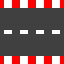

# Racecar Simulator

This simulator allows to race a car across a custom track manually or autonomously by training a model.

## Game Setup
Settings for the game can be changed in `settings.json`

### Description of `settings.json`

| Parameter   | Description                   |
| ----------- | ----------------------------- |
| Track       | The track being used          |
| Start       | Starting positon of car       |
| Laps        | Laps to complete              |
| FPS         | FPS of the game               |
| Car         | Car parameters (velocity, acc)|
| Display Size| Size of game screen           |

### Track number to piece type

|Number | Piece |
|------ | ----- |
|0      | |
