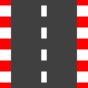
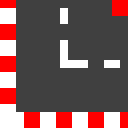
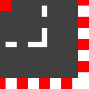

# Racecar Simulator

This simulator allows to race a car across a custom track manually or autonomously by training a model.

## Game Setup
Settings for the game can be changed in `settings.json`

### Description of `settings.json`

| Parameter   | Description                   |
| ----------- | ----------------------------- |
| Track       | The track being used          |
| Start       | Starting positon of car       |
| Laps        | Laps to complete              |
| FPS         | FPS of the game               |
| Car         | Car parameters (velocity, acc)|
| Display Size| Size of game screen           |

### Track number to piece type

|Number | Piece |
|------ | ----- |
|0      |  |
|1      |    |
|2      |     |
|3      |    |
|4      |  |
|5      | |
|6      |       |

## Running the game manually
Run `python game.py manual` to run the game manually.
### Controls
| Control | Key  |
| ------- | ---- |
| Forward | W    |
| Backward| S    |
| Left    | A    |
| Right   | D    |
| Reset   | Space|

## Training a Model
Run `python game.py [number of steps] [name of model]` to train a model with a number of steps and a given name
If a custom rewward function is desired, edit the `step()` function within `model.py`

## Testing a Model
Run `python game.py [name of model]` to test a model
